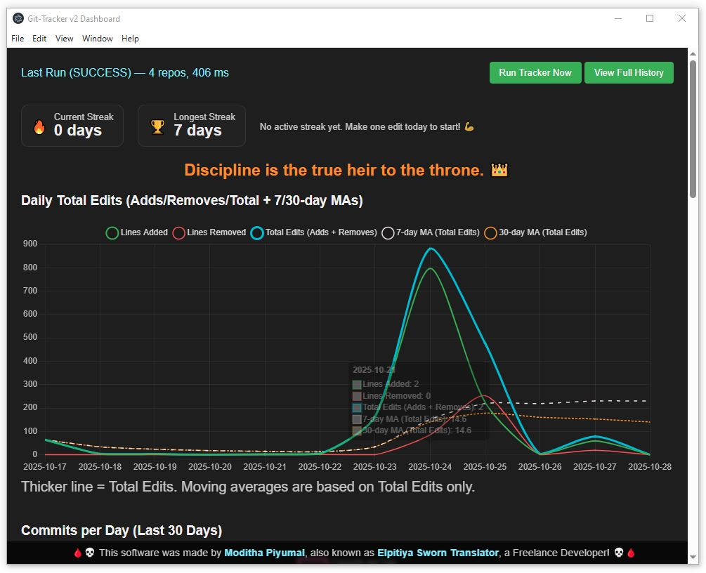
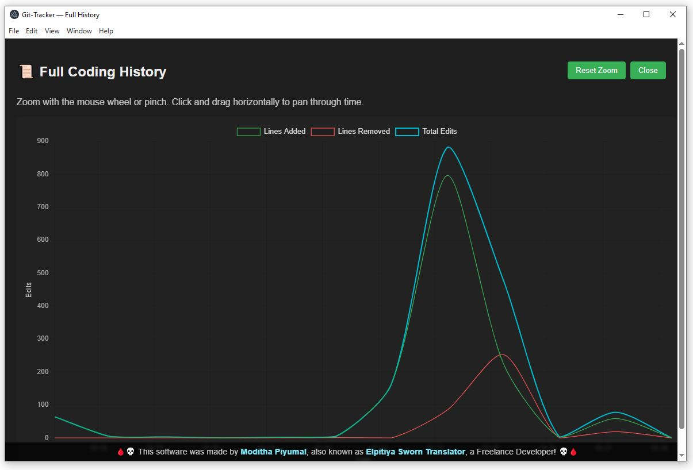

# 🧭 Git-Tracker v2

**Built by [Moditha Piyumal (Elpitiya Sworn Translator)]**, learning to code one project at a time.

---

## 🌱 About This Project

Git-Tracker v2 is my first complete desktop app built with **Electron + Chart.js**.\
I made it to keep track of my daily coding progress across different repositories.\
It shows how many lines I add or remove each day, keeps a streak counter, and lets me visualize my long-term growth.

This project is not meant to look “professional-enterprise.”\
It’s my personal learning journey — how I’m training myself to become a real developer in the age of AI.

---

## ✨ What It Does

- 🔄 Tracks lines added / removed across multiple Git repositories
- 📊 Shows clear charts (daily edits, commits, repo shares, timelines)
- 🧮 Calculates 7-day and 30-day moving averages
- 🔔 Keeps streak stats to motivate consistency
- 💀 Includes my own fixed signature banner at the bottom (my mark of creation)
- 💾 Runs automatically once per day or on demand

---

## 🪄 Screenshots

| Dashboard                                                   | History Window                                                        |
| ----------------------------------------------------------- | --------------------------------------------------------------------- |
|  |  |

---

## ⚙️ How to Run

1. **Install Node.js** if you haven’t already.

2. Clone or download this repository.

3. In the project folder, open a terminal and run:

   ```bash
   npm install
   npm start
   ```

4. The dashboard window should open automatically.

5. Click **Run Tracker Now** to collect data immediately.

_(If you’re not using Git yet, the included \***\*seed_demo_history.js\*\*** script can create sample demo data.)_

---

## 🧉 How It Works (Short Version)

- The app scans selected Git repositories on your computer.
- It counts the lines changed each day.
- Results are saved into a small local database.
- The dashboard (built with Chart.js) displays progress over time.
- A background scheduler runs the tracker automatically once per day.
- A simple renderer-side logger quietly records any UI errors to help with debugging.

---

## 🛠 Built With

| Tool                          | Purpose                               |
| ----------------------------- | ------------------------------------- |
| **Electron**                  | Desktop framework for JavaScript apps |
| **Node.js**                   | Handles filesystem & Git scanning     |
| **Chart.js**                  | Visualizes coding progress            |
| **SQLite + Prisma (Planned)** | Data storage layer                    |
| **Tailwind CSS (Planned)**    | Future UI refinement                  |

---

## 🔮 Planned Improvements

- 🧺 Cleaner modular code structure
- 💬 Better notifications / alerts
- 📈 More detailed weekly analytics
- 🧏 Improved charts for per-repository stats
- 🔐 Optional user authentication (for future multi-user version)

---

## 💻 Credits & Signature

This software was made with patience and curiosity — line by line —\
by **Moditha Piyumal**, also known as **Elpitiya Sworn Translator**,\
a Freelance Developer from Sri Lanka. 💀🦨

> “A dragon does not fear the storm — it becomes the storm.”

---

## 📜 License

This project is shared for learning purposes.\
You are free to fork, explore, and improve it.\
Please credit the original author if you share modified versions.

---

## 🏁 Final Note

This is my starting point — not perfection.\
If you’re a beginner like me, I hope this inspires you to start something,\
no matter how small it feels at first.

Thank you for reading 💪
